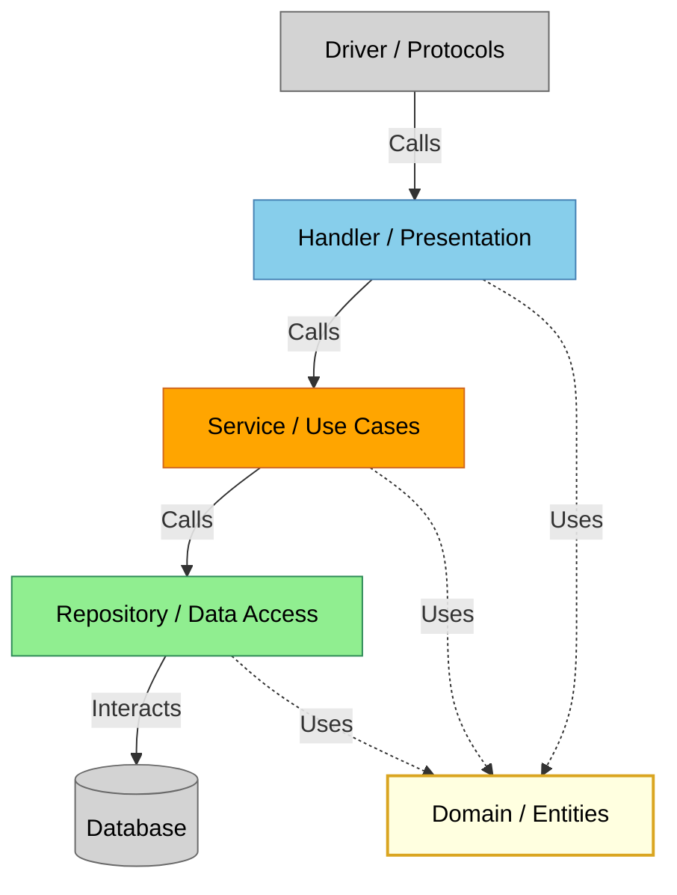

# Goroutine

Want to join the poject? Check the guidelines first:
Blah blah blah

## Table of Contents
- [Keywords](#keywords)
- [Architecture](#architecture)
- [Test suite](#test-suite)
- [Linting](#linting)
- [Security](#security)
- [CI](#ci)
- [CD](#cd)
- [Observability](#observability)
- [Worflow](#worflow)
- [LLM usage](#llm-usage)

## Keywords
All technologies and methodologies used in the project:
- **Languages:** Go
- **Architecture & Design:** Clean Architecture, TDD, Clean Code
- **Database:** PostgreSQL, Goose (Migrations)
- **Infrastructure:** Docker, Docker Compose, Ansible, Makefile, Staging & Production
- **CI/CD:** GitHub Actions, Trunk-based Development, Lefthook, Release Drafter
- **Observability** Prometheus, Grafana, Loki, Node Exporter
- **Security:** Argon2id, JWT, Secrecy (Custom package), Trivy, Hadolint
- **Quality Assurance:** GolangCI-Lint, Gofumpt, Govulncheck, Race Detection
- **Documentation:** Swagger

## Architecture

##### This project uses clean architecture with rings as such:
- Domain, containing critical buisness entities with invariants ensuring validity
- Handler, which is responsible for parsing requests and sending responses
- Service, implementing use cases
- Repository, hiding database implementation details
- Driver, managing protocols, done with external modules

##### Hierarchy:
- Driver knows nothing about repository
- Repository knows nothing about service
- Service knows nothing about handler
- Domain knows nothing

Why

##### Why:
- Leads to decoupling of components, ensuring that every part is testable with mocks.
- The core of the app (domain, use cases) can't break due to more of an infrustructual change, say, replacing the standard router, or migrating to another database
- Maintainability improves significantly

Tradeoffs

##### Tradeoffs:
- Slightly more boilerplate code
- Increased complexity af first

## Test suite
##### The project has 3 types of tests and follows testing pyramid principle:
- Unit tests cover all the independent code blocks. Runs with race detection.
- Integration tests verify interaction between a repository and a database. Runs with race detection.
- End-to-end tests check some happy paths to catch tricky infrastructure issues.

Why

##### Why:
- Ensures no regressions or manual testing is done, which pays off quickly.
- Automates CI process.

Tradeoffs

##### Tradeoffs:
- More code to maintain.
- Slightly slower development at first.

## Linting
##### Linting is exstensively used:
- ColangCi-lint for code checks, including govet, gocritic, gorevive, staticcheck, errcheck and others
- Hadolint for static Dockerfile checks
- Trivy for built container image analysis
- Gofumpt for strict style enforcement

Why

##### Why:
- Easy way to find potential problems early

Tradeoffs

##### Tradeoffs:
- More configs to create
- Checks take some time

## Security
- There's a 'secrecy' package that allows to incapsulate sensible data (primarily tokens) the way it can't be accidentally printed in logs, showing a placeholder instead.
- Many edge cases are covered by the test suite, avoiding unexpected responses.
- The server is automatically hardened during CD

Why

##### Why:
- It's absolutely crucial to protect the app from scholars hacking it in an hour after release
- Prevents unintended money loss

Tradeoffs

##### Tradeoffs:
- More input checks to be done

## CI
- The repository follows the trunk-based development methodology, fully automating integration process

- Lefthook is used to make basic checks locally for quicker response. More advanced checks are performed remotely after push
- Release drafter automatically generates changelogs from PR
- The app is built using docker
- Makefile ensures build and tooling is consistent across different environments and developers

##### The branch protection rules on GitHub are configured the way that only verified code can be deployed:
- Forbid direct pushes to main
- Forbid administrator overrides
- Set required check jobs to be green before merge

Why

##### Why:
- Fewer conflicts
- Faster iteration speed
- No broken windows effect
- No human factor

Tradeoffs

##### Tradeoffs:
- Writing the pipeline takes some time

## CD
##### The whole CD pipeline is almost fully automated as well:
- Get a VDS server, generate ssh id keys and copy the public one (manual)
- Set up config in GitHub secrets storage (manual)
- Install required packages
- Configure unattended upgrades for automates
- Configure fail2ban
- Configure log rotation
- Start docker service
- Disable root login, password authentication
- Opt-in ports
- Create a user and an app directory
- Copy configs and run the app

Why

##### Why:
- It's secure and convenient to start with a stock server and end up with hardened one with app running within minutes
- No human factor

Tradeoffs

##### Tradeoffs:
- Writing the pipeline takes some time

## Observability
Prometheus, Loki, Node-exporter and Grafana are used for clear and remote observability:
- Detailed resource usage of a machine
- Logs can be read remotely for all containers
- RED: core app metrics such as RPS, erorr rate, duration are collected

## Worflow
This project follows a issue-pull model to track existing issues and create solutions.

Why

##### Why:
- It allows for atomic changes that can be easily reviewed by human and machine.
- Cleaner history
- Less of a human factor

## LLM usage
I utilized LLMs as an interactive documentation, rarely letting them to write some configs or code under guidance. This readme is 100% written by me btw :3

Why

##### Why:
- No copy-paste can teach you something
- No need to search the documentation
- The responses are correct most of the time
- Interactive learning
- AI can't write good code without a detailed promt (code written in spoken english with some slight details ommitted), that's why it's easier to write Go code, which is structured and unambigous

Tradeoffs

##### Tradeoffs:
- It fails to warn that some features are deprecated, luckily, most tools do that themselves

