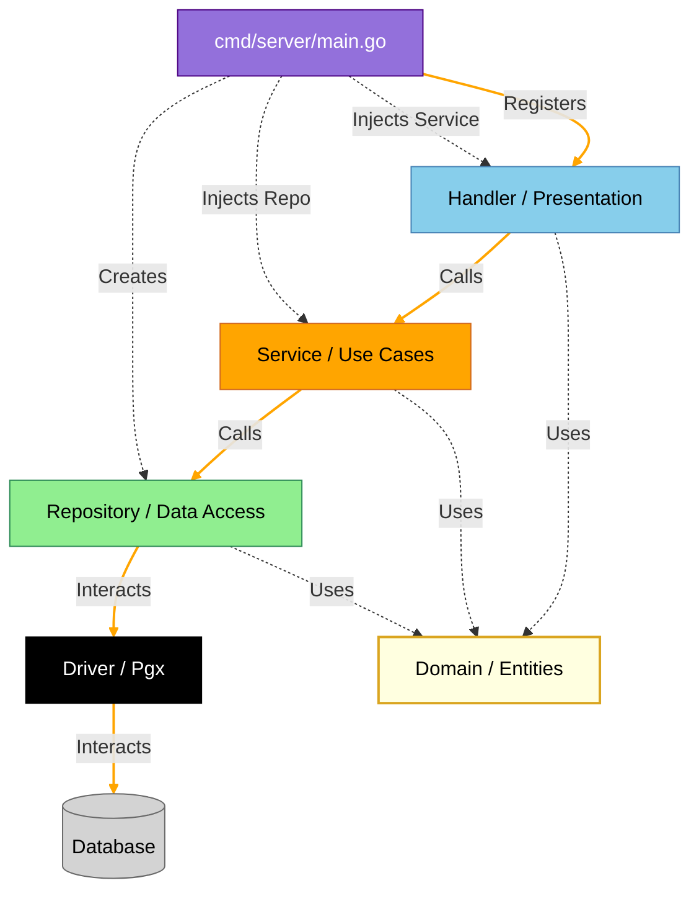

# Goroutine

Want to join the poject? Check the guidelines first:
Blah blah blah

## Table of Contents
- [Keywords](#keywords)
- [Quick Start](#quick-start)
- [Architecture](#architecture)
- [Project Structure](#project-structure)
- [API Documentation](#api-documentation)
- [Test suite](#test-suite)
- [Linting](#linting)
- [Security](#security)
- [CI](#ci)
- [CD](#cd)
- [Observability](#observability)
- [Worflow](#worflow)
- [LLM usage](#llm-usage)

## Keywords
All technologies and methodologies used in the project:
- **Languages:** Go
- **Architecture & Design:** Clean Architecture, TDD, Clean Code
- **Database:** PostgreSQL, Goose (Migrations)
- **Infrastructure:** Docker, Docker Compose, Ansible, Makefile, Staging & Production
- **CI/CD:** GitHub Actions, Trunk-based Development, Lefthook, Release Drafter
- **Observability** Prometheus, Grafana, Loki, Node Exporter
- **Security:** Argon2id, JWT, Secrecy (Custom package), Trivy, Hadolint
- **Quality Assurance:** GolangCI-Lint, Gofumpt, Govulncheck, Race Detection
- **Documentation:** Swagger

## Quick Start
To get started with this project, follow the steps below:

0. Clone the Repository:
    ```sh
    git clone git@github.com:mipselqq/goroutine.git
    ```
1. Install Go and ensure the binaries directory is added to your `PATH`.
2. Install required tools:
   ```sh
   make tools
   ```
3. Create a `.env.dev` file based on the provided `.env.example`:
   ```sh
   cp .env.example .env.dev
   ```
4. Start the development environment:
   ```sh
   make dev-env
   ```
5. Run the development server:
   ```sh
   make dev
   ```

## Architecture


## Project Structure
Annotated overview of the repository layout:
- `ansible/` - Server provisioning and configuration management.
- `cmd/` - Entry points (main.go).
- `docs/` - Generated Swagger UI documentation and OpenAPI specs.
- `infra/` - Observability configurations (Grafana, Loki, Prometheus).
- `internal/` - Private application code.
  - `app/` - Application-level components (routing, startup).
  - `domain/` - Core business entities with invariants (email, password).
  - `handler/` - Http handlers (API endpoints).
  - `middleware/` - Http middlewares (metrics, auth).
  - `repository/` - Persistence layer (database interactions).
  - `service/` - Use case layer (business rules).
- `migrations/` - SQL migration files managed by Goose.
- `tests/` - End-to-end test suites.

## API Documentation
The API is documented using Swagger (OpenAPI 3.0).
- **Local Swagger UI:** Once the app is running (`make dev`), visit [http://localhost:8080/swagger/index.html](http://localhost:8080/swagger/index.html).
- **Remote Swagger UI** Go to /swagger on host specified in the description of this repo.
- **Specs:** Generated files are located in [docs/](docs/).
To regenerate specs after changing code comments:
```sh
```


##### This project uses clean architecture with rings as such:
- Domain, containing critical buisness entities with invariants ensuring validity
- Handler, which is responsible for parsing requests and sending responses
- Service, implementing use cases
- Repository, hiding database implementation details
- Driver, managing protocols, done with external modules

<details>
<summary>Why</summary>

##### Why:
- Leads to decoupling of components, ensuring that every part is testable with mocks.
- The core of the app (domain, use cases) can't break due to more of an infrustructual change, say, replacing the standard router, or migrating to another database
- Maintainability improves significantly
</details>

<details>
<summary>Tradeoffs</summary>

##### Tradeoffs:
- Slightly more boilerplate code
- Increased complexity af first
</details>

## Test suite
##### Project has 3 types of tests and follows testing pyramid principle:
- Unit tests: Cover all independent code blocks. Run with race detection
- Integration tests: Verify interaction between repository and database. Run with race detection
- End-to-end tests: Check happy paths to catch tricky infrastructure issues

<details>
<summary>Why</summary>

##### Why:
- Ensures no regressions and replaces manual testing
- Automates CI process
</details>

<details>
<summary>Tradeoffs</summary>

##### Tradeoffs:
- More code to maintain
- Slightly slower development at first
</details>

## Linting
##### Linting is extensively used:
- GolangCI-Lint: Code checks (govet, gocritic, gorevive, staticcheck, errcheck)
- Hadolint: Static Dockerfile checks
- Trivy: Container image analysis
- Gofumpt: Strict style enforcement

<details>
<summary>Why</summary>

##### Why:
- Finds potential problems early
</details>


<details>
<summary>Tradeoffs</summary>

##### Tradeoffs:
- More configs to create
- Checks take some time
</details>

## Security
- **Secrecy:** Custom package to encapsulate sensitive data (tokens) and prevent accidental logging
- **Coverage:** Edge cases covered by test suite to avoid unexpected responses
- **Hardening:** Server automatically hardened during CD

<details>
<summary>Why</summary>

##### Why:
- Crucial to protect app from hacking immediately after release
- Prevents unintended money loss
</details>

<details>
<summary>Tradeoffs</summary>

##### Tradeoffs:
- More input checks
</details>

## CI
- Trunk-based development
- Fully automated integration process

- **Lefthook:** Basic local checks for quick response
- **Remote checks:** Advanced checks performed after push
- **Release Drafter:** Automatically generates changelogs from PR
- **Docker:** Used for building the app
- **Makefile:** Ensures build and tooling is consistent across environments

##### Branch protection rules (GitHub):
- Forbid direct pushes to main
- Forbid administrator overrides
- Require green check jobs before merge

<details>
<summary>Why</summary>

##### Why:
- Fewer conflicts
- Faster iteration speed
- No broken windows effect
- No human factor
</details>

<details>
<summary>Tradeoffs</summary>

##### Tradeoffs:
- Pipeline setup takes time
</details>

## CD
##### CD pipeline is almost fully automated:
- Get VDS server, generate SSH keys, copy public key (manual)
- Set up config in GitHub secrets (manual)
- Install required packages
- Configure unattended upgrades
- Configure fail2ban
- Configure log rotation
- Start docker service
- Disable root login and password authentication
- Open required ports
- Create user and app directory
- Copy configs and run app

<details>
<summary>Why</summary>

##### Why:
- Secure and convenient way to get hardened server with running app
- No human factor
</details>

<details>
<summary>Tradeoffs</summary>

##### Tradeoffs:
- Writing the pipeline takes some time
</details>

## Observability
Prometheus, Loki, Node-exporter, and Grafana provide clear remote observability:
- Detailed resource usage of machine
- Remote logs for all containers
- **RED:** Core app metrics (RPS, error rate, duration)

> **Tip:** To see metrics on local dev in Grafana, ensure your firewall allows requests from `172.16.0.0/12`.

## Workflow
Project follows issue-pull model to track issues and create solutions.

<details>
<summary>Why</summary>

##### Why:
- Allows atomic changes easily reviewed by human and machine
- Cleaner history
- Less human factor
</details>

## LLM usage
LLMs utilized as interactive documentation. Rarely used for writing configs or code under guidance.

<details>
<summary>Why</summary>

##### Why:
- No copy-paste can teach you something
- No need to search the documentation
- The responses are correct most of the time
- Interactive learning
- AI can't write good code without a detailed promt (code written in spoken english with some slight details ommitted), that's why it's easier to write Go code, which is structured and unambigous
</details>

<details>
<summary>Tradeoffs</summary>

##### Tradeoffs:
- It fails to warn that some features are deprecated, luckily, most tools do that themselves
</details>
