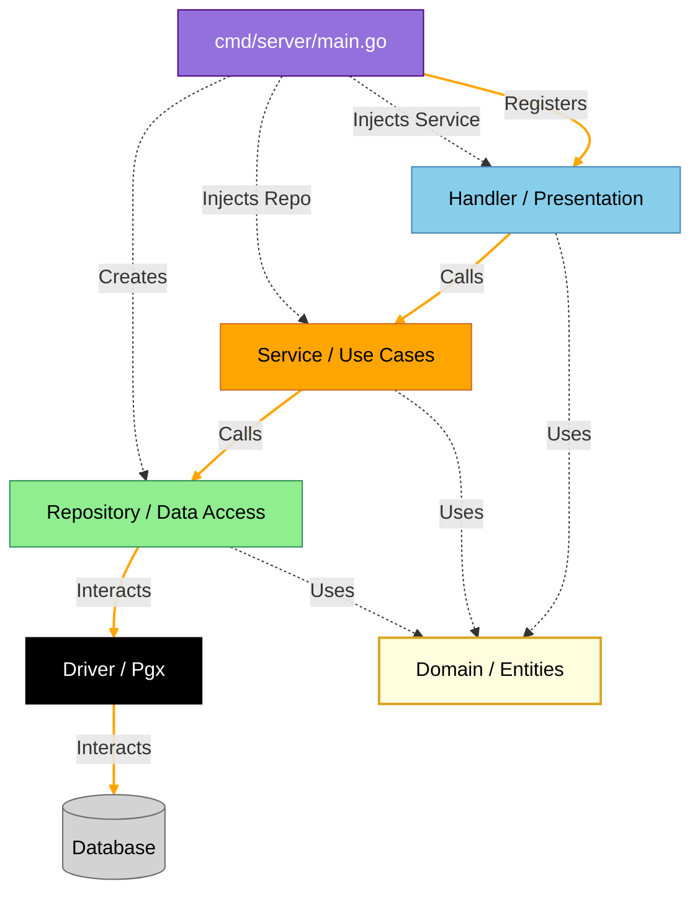

# Goroutine

## Table of Contents
- [Summary](#summary)
- [Keywords](#keywords)
- [Architecture](#architecture)
- [Quick Start](#quick-start)
- [Project Structure](#project-structure)
- [API Documentation](#api-documentation)
- [Test suite](#test-suite)
- [Linting](#linting)
- [Security](#security)
- [CI](#ci)
- [CD](#cd)
- [Observability](#observability)
- [Workflow](#workflow)
- [LLM usage](#llm-usage)
- [Developer Guidelines](DEVELOPER_GUIDELINES.md)

# Summary
Kanban-style **task tracker** API written in Go. Reference implementation
of **production-grade** backend service.

## Keywords
All technologies and methodologies used in the project:
- **Languages:** Go, TypeScript (k6)
- **Architecture & Design:** Clean Architecture, TDD, Clean Code, stdlib (net/http), UUIDv7, Value Objects
- **Database:** PostgreSQL, jackc/pgx (Driver), Goose (Migrations)
- **Infrastructure:** Docker, Docker Compose, Ansible, Makefile, Staging & Production
- **CI/CD:** GitHub Actions, Trunk-based Development, Lefthook, Release Drafter
- **Observability**: Prometheus, Grafana, Alloy, Loki, Node Exporter, log/slog + lmittmann/tint, 
- **Security:** Distroless, Argon2id, JWT, Trivy, Hadolint, Secrecy (Custom package)
- **Quality Assurance:** Table-Driven Unit, Integration, E2E, k6 (Race and load), tests, GolangCI-Lint, Gofumpt, Govulncheck
- **Documentation:** OpenAPI, Swagger, Swaggo

## Quick Start
To get started with this project, follow the steps below:

0. Clone the Repository:
    ```sh
    git clone git@github.com:mipselqq/goroutine.git
    ```
1. Install Go and ensure the binaries directory is added to your `PATH`, install Docker.
2. Install required tools:
   ```sh
   make tools
   ```
3. Create a `.env.dev` file based on the provided `.env.example`:
   ```sh
   cp .env.example .env.dev
   ```
4. Start the development environment:
   ```sh
   make dev-env
   ```
5. Run the development server:
   ```sh
   make dev
   ```

## Architecture


```mermaid
graph TD
    Main[cmd/server/main.go]:::config
    Handler[Handler / Presentation]:::handler
    Service[Service / Use Cases]:::service
    Repo[Repository / Data Access]:::repo
    Domain[Domain / Entities]:::domain
    Driver[Driver / Pgx]:::driver
    DB[(Database)]:::db

    %% Injection
    Main -.->|Creates| Repo
    Main -.->|Injects Repo| Service
    Main -.->|Injects Service| Handler
    Main -->|Registers| Handler

    %% Runtime Flow
    Handler -->|Calls| Service
    Service -->|Calls| Repo
    Repo -->|Interacts| Driver
    Driver -->|Interacts| DB

    %% Domain Dependencies
    Handler -.->|Uses| Domain
    Service -.->|Uses| Domain
    Repo -.->|Uses| Domain

    classDef driver fill:#000,stroke:#000,color:#fff;
    classDef handler fill:#87CEEB,stroke:#4682B4,color:#000;
    classDef service fill:#FFA500,stroke:#D2691E,color:#000;
    classDef repo fill:#90EE90,stroke:#2E8B57,color:#000;
    classDef db fill:#D3D3D3,stroke:#696969,color:#000;
    classDef domain fill:#FFFFE0,stroke:#DAA520,stroke-width:2px,color:#000;
    classDef config fill:#9370DB,stroke:#4B0082,color:#fff;
    linkStyle 3,4,5,6,7 stroke:#FFA500,stroke-width:2px;
```

##### This project uses clean architecture with rings as such:
- **Domain**, containing value objects with validation invariants
- **Handler**, establishing API contract
- **Service**, implementing use cases
- **Repository**, hiding database implementation details
- **Driver**, managing protocols, done with external modules

##### Benefits.
At cost of more boilerplate code, we get following advantages:
- **Decoupling** of components, ensuring high **testability** with mocks.
- **Clear boundaries** allow developers to **focus** more
- **Complexity doesn't grow exponentially** as the project evolves
- The core of the app (domain, use cases) **can't break due to more of an infrastructural change**, say, replacing the standard router, or migrating to another database

## Project Structure
Annotated overview of the repository layout:
- `cmd/` - Entry points (`main.go`).
  - `ping/` - Ping program for distroless healthcheck.
  - `server/` - Main HTTP server entry point.
- `docs/` - Handwritten and generated documentation (Swaggo)
- `infra/` - Infrastructure configs.
   - `alloy/` - Grafana Alloy pipeline (`config.alloy`).
   - `ansible/` - Server provisioning (e.g. Ubuntu playbook).
   - `grafana/` - Dashboard JSON under `dashboards/`; provisioning under `provisioning/`.
   - `prometheus/` - Prometheus configs.
- `internal/` - Private application code.
   - `app/` - `app.go`, `startup.go` — wiring and startup.
   - `config/` - Configuration (env parsing, database URL, app settings).
   - `domain/` - Core entities and invariants (boards, columns, tasks, users, email, IDs).
   - `http/` - HTTP layer.
      - `handler/` - HTTP handlers (API endpoints).
      - `middleware/` - HTTP middleware (auth, CORS, metrics, request IDs).
      - `httpschema/` - Structured responses, error mapping, validation helpers, context keys.
      - `route.go` - Route registration; `swagger.go` - Swagger UI route wiring.
   - `logging/` - Logging adapters and logger factory.
   - `repository/` - Persistence layer (database access).
   - `service/` - Use case layer (business rules).
   - `secrecy/` - Handling of sensitive values (redaction, etc.).
   - `testutil/` - Shared test helpers (database, HTTP, fixtures, logging).
- `k6/` - k6 scenarios for load testing and application-level race checks.
- `migrations/` - SQL migrations managed by Goose.
- `tests/` - End-to-end test suite.

## API Documentation
To get interactive remote documentation, API is documented using Swagger (OpenAPI 3.0).
- **Local Swagger UI:** Once the app is running (`make dev`), visit [http://localhost:8080/swagger/index.html](http://localhost:8080/v1/swagger).
- **Remote Swagger UI** Go to /v1/swagger on host specified in the description of this repo.
- **Specs:** Generated files are located in [docs/openapi](docs/openapi).

## Test suite
##### Project generally has 5 types of tests and follows testing **pyramid** principle. At cost of writing and maintaining around 3x more code, robust test suite ensures no regressions, reduces human factor and manual testing.
- **Unit** tests: Cover all independent code blocks. Run with race detection
- **Integration** tests: Verify interaction between repository and database. Run with race detection
- **End-to-end** tests: Check happy paths to catch tricky infrastructure issues
- **Load** testing: Act as thousands of real users, stressing likely API paths
- Application-level **race checks**: Target only previously or potentially vulnerable operations

## Linting
##### Linting is extensively used to early catch bugs, vulnerabilities, and guideline violations.
- GolangCI-Lint: **Code checks** (govet, gocritic, gorevive, staticcheck, errcheck)
- Hadolint: **Static** Dockerfile checks
- Trivy: Container **image analysis**
- Gofumpt: Strict **style enforcement**

## Security
Security is treated as a first-class concern.
- Secrecy: Custom package to encapsulate credentials using SecretString container to **prevent accidental** logging or marshalling even using unpopular verbs.
- Coverage: **Edge cases** covered by test suite to avoid unexpected responses, including internal details leakage.
- Hardening: Project ensures it's running in a **safe environment** on any server.

## CI
To avoid frequent merge conflicts, integrate only qualified changes, iterate quicker, robust CI pipeline is implemented.
- Trunk-based development
- **Fully automated** integration process
- **Lefthook:** Basic local checks for quick response, auto code formatting and documentation regeneration.
- **Remote checks:** Advanced jobs performed after each push and merge
- **Release Drafter:** Automatically generates draft changelogs from PR
- **Docker:** Used for transferring and deploying standalone build images  
- **Makefile:** Ensures basic workflow and tooling is consistent across different developers

##### Branch protection rules (GitHub):
- Forbid **direct pushes** to main
- Forbid administrator **overrides**
- Require code to be **tested**, **scanned**, **built and deployed**.

## CD
- This pipeline ensures **secure**, **reproducible**, and **quick** way to get hardened server with running app in a few minutes.
##### CD pipeline is almost **fully automated**:
- Get VDS server, generate SSH keys, copy public key (manual)
- Configure reverse proxy to handle HTTPS and high-level routing
- Set up config in GitHub secrets (manual)
- Install required packages
- Configure unattended upgrades
- Configure fail2ban
- Configure log rotation
- Start Docker service
- Disable root login and password authentication
- Close all ports by default, except 443 and 80
- Create user and app directory
- Pull app Docker image
- Copy configs and run app

## Observability
log/slog is used to log errors and valuable events in code.
Prometheus, Loki, Node-exporter, and Grafana provide **clear remote observability** to investigate incidents and collect runtime data for optimizations:
- Detailed **resource usage** of machine
- **Remote logs** for all containers
- RED: Core **app metrics** (RPS, error rate, duration)

> [!WARNING]
> Some firewalls block local Grafana, ensure `172.16.0.0/12` outbound is open in case monitoring doesn't work.

## Workflow
Project follows **issue-pull** model to get cleaner history, review changes and integrate with CI/CD pipeline.

## LLM usage
LLMs helped a lot to **compensate** overhead to create this big **production-ready setup**, doing repetitive tasks **under guidance** and **reviewing** PRs for mistakes I could **overlook doing self-reviews**. It acts well as **interactive** documentation. Also works great during **brainstorming**.

Want to join the project? Check the guidelines first:
[Developer Guidelines](DEVELOPER_GUIDELINES.md)
