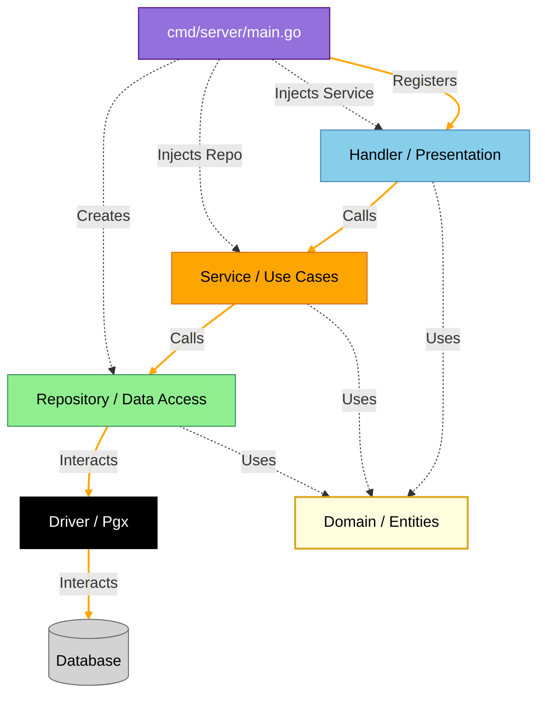

# Goroutine

## Table of Contents
- [Summary](#summary)
- [Keywords](#keywords)
- [Architecture](#architecture)
- [Quick Start](#quick-start)
- [Project Structure](#project-structure)
- [API Documentation](#api-documentation)
- [Test suite](#test-suite)
- [Linting](#linting)
- [Security](#security)
- [CI](#ci)
- [CD](#cd)
- [Observability](#observability)
- [Performance](#performance)
- [Workflow](#workflow)
- [AI-assisted development](#ai-assisted-development)
- [Documentation](#documentation)

## Summary
Kanban-style **task tracker** API written in Go. A reference implementation
of a **production-grade** backend service.

## Keywords
All technologies and methodologies used in the project:
- **Languages:** Go, TypeScript (k6)
- **Architecture & Design:** Clean Architecture, TDD, Clean Code, stdlib (net/http), UUIDv7, Value Objects
- **Database:** PostgreSQL, jackc/pgx (Driver), Goose (Migrations)
- **Infrastructure:** Docker, Docker Compose, Ansible, Makefile, Staging & Production
- **CI/CD:** GitHub Actions, Trunk-based Development, Lefthook, Release Drafter
- **Observability**: Prometheus, Grafana, Alloy, Loki, Node Exporter, log/slog + lmittmann/tint, 
- **Security:** Distroless, Argon2id, JWT, Trivy, Hadolint, Secrecy (Custom package)
- **Quality Assurance:** Table-driven unit tests, integration tests, E2E tests, k6 load and race tests, GolangCI-Lint, Gofumpt, Govulncheck
- **Documentation:** OpenAPI, Swagger, Swaggo

## Architecture

```mermaid
graph TD
    Main[cmd/server/main.go]:::config
    Handler[Handler / Presentation]:::handler
    Service[Service / Use Cases]:::service
    Repo[Repository / Data Access]:::repo
    Domain[Domain / Entities]:::domain
    Driver[Driver / Pgx]:::driver
    DB[(Database)]:::db

    %% Injection
    Main -.->|Creates| Repo
    Main -.->|Injects Repo| Service
    Main -.->|Injects Service| Handler
    Main -->|Registers| Handler

    %% Runtime Flow
    Handler -->|Calls| Service
    Service -->|Calls| Repo
    Repo -->|Interacts| Driver
    Driver -->|Interacts| DB

    %% Domain Dependencies
    Handler -.->|Uses| Domain
    Service -.->|Uses| Domain
    Repo -.->|Uses| Domain

    classDef driver fill:#000,stroke:#000,color:#fff;
    classDef handler fill:#87CEEB,stroke:#4682B4,color:#000;
    classDef service fill:#FFA500,stroke:#D2691E,color:#000;
    classDef repo fill:#90EE90,stroke:#2E8B57,color:#000;
    classDef db fill:#D3D3D3,stroke:#696969,color:#000;
    classDef domain fill:#FFFFE0,stroke:#DAA520,stroke-width:2px,color:#000;
    classDef config fill:#9370DB,stroke:#4B0082,color:#fff;
    linkStyle 3,4,5,6,7 stroke:#FFA500,stroke-width:2px;
```

This project uses **clean architecture** with rings as such:
- **Domain**, containing value objects with validation invariants
- **Handler**, establishing API contract
- **Service**, implementing use cases
- **Repository**, hiding database implementation details
- **Driver**, managing protocols, done with external modules

At the cost of **more boilerplate** code, we get the following advantages:
- **Decoupling** of components, ensuring high **testability** with mocks.
- **Clear boundaries** allow developers to **focus** more
- **Complexity doesn't grow exponentially** as the project evolves
- The core of the app (domain, use cases) **can't break due to more of an infrastructural change**, say, replacing the standard router, or migrating to another database

## Quick Start
To get started with this project, follow the steps below:

0. Clone the Repository:
    ```sh
    git clone git@github.com:mipselqq/goroutine.git
    ```
1. Install Go and ensure the binaries directory is added to your `PATH`, install Docker.
2. Install required tools:
   ```sh
   make tools
   ```
3. Create a `.env.dev` file based on the provided `.env.example`:
   ```sh
   cp .env.example .env.dev
   ```
4. Start the development environment:
   ```sh
   make dev-env
   ```
5. Run the development server:
   ```sh
   make dev
   ```

## Project Structure
Annotated overview of the repository layout:
- `cmd/` - Entry points (`main.go`).
  - `ping/` - Ping program for distroless healthcheck.
  - `server/` - Main HTTP server entry point.
- `docs/` - Handwritten and generated documentation (Swaggo)
- `infra/` - Infrastructure configs.
   - `alloy/` - Grafana Alloy pipeline (`config.alloy`).
   - `ansible/` - Server provisioning (e.g. Ubuntu playbook).
   - `grafana/` - Dashboard JSON under `dashboards/`; provisioning under `provisioning/`.
   - `prometheus/` - Prometheus configs.
- `internal/` - Private application code.
   - `app/` - `app.go`, `startup.go` — wiring and startup.
   - `config/` - Configuration (env parsing, database URL, app settings).
   - `domain/` - Core entities and invariants (boards, columns, tasks, users, email, IDs).
   - `http/` - HTTP layer.
      - `handler/` - HTTP handlers (API endpoints).
      - `middleware/` - HTTP middleware (auth, CORS, metrics, request IDs).
      - `httpschema/` - Structured responses, error mapping, validation helpers, context keys.
      - `route.go` - Route registration; `swagger.go` - Swagger UI route wiring.
   - `logging/` - Logging adapters and logger factory.
   - `repository/` - Persistence layer (database access).
   - `service/` - Use case layer (business rules).
   - `secrecy/` - Handling of sensitive values (redaction, etc.).
   - `testutil/` - Shared test helpers (database, HTTP, fixtures, logging).
- `k6/` - k6 scenarios for load testing and application-level race checks.
- `migrations/` - SQL migrations managed by Goose.
- `tests/` - End-to-end test suite.

## API Documentation

To get interactive remote documentation, the API is documented using Swagger (OpenAPI 3.0).
- **Local Swagger UI:** Once the app is running (`make dev`), visit http://localhost:8080/v1/swagger.
- **Remote Swagger UI:** https://goroutine.mipselqq.uk/v1/swagger
- **Specs:** Generated files are located in [docs/openapi](docs/openapi).

<p align="center">
  
  
</p>

## Test suite
The project generally has 5 types of tests and follows the testing **pyramid** principle. At the cost of writing and maintaining around 3x more code, a robust test suite ensures no regressions, reduces the human factor, and manual testing.
- **Unit** tests: Cover all independent code blocks. Run with race detection
- **Integration** tests: Verify the interaction between the repository and the database. Run with race detection
- **End-to-end** tests: Check happy paths to catch tricky infrastructure issues
- **Load** testing: Act as thousands of real users, stressing likely API paths
- Application-level **race checks**: Target only previously or potentially vulnerable operations

Static coverage analysis by built-in Go tooling proves that the core functionality coverage is **high**, however, the effective coverage (including indirect testing and other kinds of tests) is **around 90%**:
```
ok      goroutine/internal/config            coverage: 88.6% of statements
ok      goroutine/internal/http              coverage: 100.0% of statements
ok      goroutine/internal/http/handler      coverage: 99.6% of statements
ok      goroutine/internal/http/httpschema   coverage: 10.3% of statements (indirectly tested in http/handler)
ok      goroutine/internal/http/middleware    coverage: 98.8% of statements
ok      goroutine/internal/secrecy           coverage: 71.4% of statements (indirectly tested in domain)
ok      goroutine/internal/service           coverage: 85.9% of statements
ok      goroutine/internal/domain            coverage: 89.9% of statements
```

## Linting
Linting is extensively used to early catch bugs, vulnerabilities, and guideline violations.
- GolangCI-Lint: **Code checks** (govet, gocritic, gorevive, staticcheck, errcheck)
- Hadolint: **Static** Dockerfile checks
- Trivy: Container **image analysis**
- Gofumpt: Strict **style enforcement**

## Security
Security is treated as a first-class concern.
- Secrecy: A custom package to encapsulate credentials using the SecretString container to **prevent accidental** logging or marshalling even using unpopular verbs.
- Limiting: Basic request **limits** (body size, timeouts) are set up as a **second line of defense** against bugged clients and simple DOS attacks.
- Coverage: **Edge cases** covered by the test suite to avoid unexpected responses, including internal details leakage.
- Hardening: The project ensures it's running in a **safe environment** on any server.

## CI
To avoid frequent **merge conflicts**, integrate only qualified changes, and iterate quicker, a robust CI pipeline is implemented:
- Trunk-based development
- **Fully automated** integration process
- **Lefthook:** Basic local checks for quick response, auto code formatting and documentation regeneration.
- **Remote checks:** Advanced jobs performed after each push and merge
- **Release Drafter:** Automatically generates draft changelogs from PR
- **Docker:** Used for transferring and deploying standalone build images  
- **Makefile:** Ensures basic workflow and tooling is consistent across different developers


Branch protection rules (GitHub):
- Forbid **direct pushes** to main
- Forbid administrator **overrides**
- Require code to be **tested**, **scanned**, **built and deployed**.

## CD
**Highly automated** pipeline below ensures a **secure**, **reproducible**, and **quick** way to get a hardened server with a running app in a few minutes:
- Get VDS server, generate SSH keys, copy public key (manual)
- Configure reverse proxy to handle HTTPS and high-level routing
- Set up config in GitHub secrets (manual)
- Install required packages
- Configure unattended upgrades
- Configure fail2ban
- Configure log rotation
- Start Docker service
- Disable root login and password authentication
- Close all ports by default, except 443 and 80
- Create user and app directory
- Pull app Docker image
- Copy configs and run app

## Observability
log/slog is used to log errors and valuable events in the code.
Prometheus, Loki, Node-exporter, and Grafana provide **clear remote observability** to investigate incidents and collect runtime data for optimizations:
- Detailed **resource usage** of the machine
- **Remote logs** for all containers
- RED: Core **app metrics** (RPS, error rate, duration)

> [!WARNING]
> Some firewalls block local Grafana, ensure `172.16.0.0/12` outbound is open in case monitoring doesn't work.

## Performance
Though high performance was never a goal of this project, the code is able to handle up to **1200 test users** (VUs) creating objects, reading and updating them, according to the latest k6 run.

Server specs: 1 vCPU 2.5 GHz, 900 MB RAM, SSD, Ubuntu

Containers running: app, Postgres, Prometheus

<details>
<summary>Full k6 CLI output</summary>

```text
█ THRESHOLDS

    http_req_duration
    ✓ 'p(95) < 1000' p(95)=985.17ms

    http_req_failed
    ✗ 'rate < 0.01' rate=1.00%


  █ TOTAL RESULTS

    checks_total.......: 976681 239.272122/s
    checks_succeeded...: 98.99% 966885 out of 976681
    checks_failed......: 1.00%  9796 out of 976681

    ✓ register status is 200
    ✓ login status is 200
    ✗ createBoard status is 201
      ↳  98% — ✓ 21855 / ✗ 444
    ✗ createColumn status is 201
      ↳  98% — ✓ 82243 / ✗ 927
    ✗ createTask status is 201
      ↳  98% — ✓ 769597 / ✗ 8177
    ✗ getAggregate status is 200
      ↳  99% — ✓ 19604 / ✗ 69
    ✗ getBoard status is 200
      ↳  99% — ✓ 1598 / ✗ 7
    ✗ listTasks status is 200
      ↳  99% — ✓ 4594 / ✗ 13
    ✗ moveTask status is 200
      ↳  99% — ✓ 15699 / ✗ 46
    ✗ deleteColumn status is 204
      ↳  99% — ✓ 1544 / ✗ 3
    ✗ deleteTask status is 204
      ↳  99% — ✓ 29939 / ✗ 73
    ✗ updateTask status is 200
      ↳  99% — ✓ 14490 / ✗ 27
    ✗ deleteBoard status is 204
      ↳  99% — ✓ 5720 / ✗ 10

    HTTP
    http_req_duration..............: avg=1.08s    min=0s     med=118.31ms max=1m0s   p(90)=569.92ms p(95)=985.17ms
      { expected_response:true }...: avg=494.84ms min=2.71ms med=115.64ms max=38s    p(90)=541.28ms p(95)=812.83ms
    http_req_failed................: 1.00%  9796 out of 976681
    http_reqs......................: 976681 239.272122/s

    EXECUTION
    iteration_duration.............: avg=4m9s     min=12.55s med=2m55s    max=14m53s p(90)=9m10s    p(95)=10m15s
    iterations.....................: 11222  2.749221/s
    vus............................: 1400   min=13             max=1400
    vus_max........................: 2000   min=2000           max=2000

    NETWORK
    data_received..................: 586 MB 144 kB/s
    data_sent......................: 122 MB 30 kB/s


running (1h08m02.2s), 0000/2000 VUs, 11222 complete and 1400 interrupted iterations
rampToBreak ✗ [========================>-------------] 1330/2000 VUs  1h08m01.7s/1h41m40.0s
ERRO[4082] thresholds on metrics 'http_req_failed' were crossed; at least one has abortOnFail enabled, stopping test prematurely
make: *** [Makefile:88: happy-load] Error 99
```

</details>

Thresholds that cause the test to stop if crossed:
- 95% of users must receive response in under **1 second**
- Total error rate must be below **1%**


Quick analysis of the metrics shows:
- Server is **out of CPU** capacity, which is mostly consumed by Postgres
- Near out of available RAM
- There are no memory leaks
- So the **bottleneck is database**, as expected, because of chosen columns/tasks positioning algorithm with cascade updates (for simplicity)

## Workflow
The project follows the **issue-pull** model to get a cleaner history, review changes, and integrate with the CI/CD pipeline.
To keep issues and PRs consistent, the following templates are used:
- [PR](.github/PULL_REQUEST_TEMPLATE.md)
- [Feature issue](.github/ISSUE_TEMPLATE/feature.md)
- [Bug issue](.github/ISSUE_TEMPLATE/bug.md)
- [Todo issue](.github/ISSUE_TEMPLATE/todo.md)

Also, the following labels are used:
- feat (user-visible features)
- bug
- security
- documentation
- refactor
- maintenance, todo, chore (other non-user-visible tasks)
- enhancement (low priority changes to improve codebase)
- go, docker, github-actions (for Dependabot PRs)

Commits and PR names are formatted using the Conventional Commits specification.

## AI-assisted development
LLMs help a lot to **compensate** the overhead to create this big **production-ready setup**, doing **repetitive tasks** under guidance and **reviewing** PRs for mistakes that may be **overlooked during human reviews**. Also, AI proposed useful ideas during **brainstorming**.

## Documentation
Deploy guide: [docs/deploy.md](docs/deploy.md)

Developer guidelines: [docs/developer-guidelines.md](docs/developer-guidelines.md)
